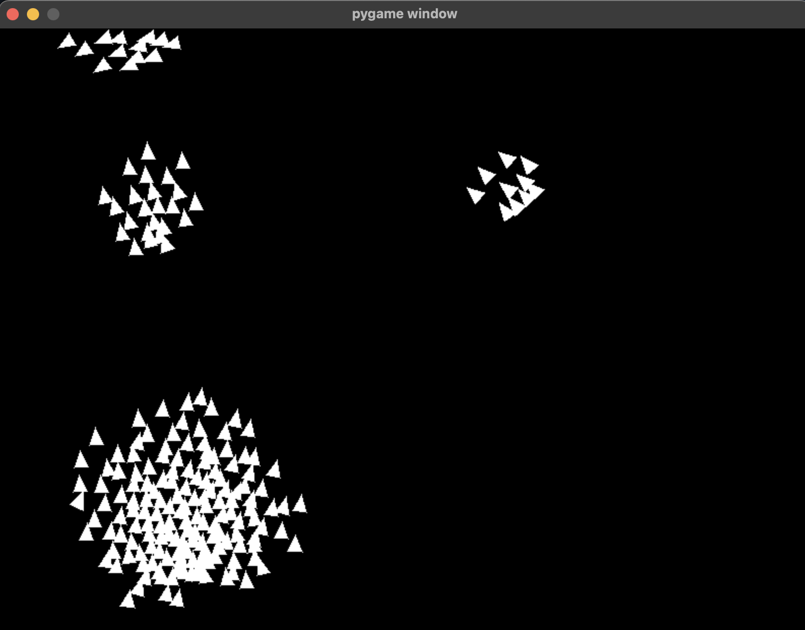

## Boids simulation

The provided code simulates the behavior of a flock of boids. Boids are artificial lifeforms that follow three main rules: separation, alignment, and cohesion, to create a coordinated group movement. These rules are used to simulate the behavior of birds, fish, or other creatures that move in flocks or schools.

#### Here's what the code does and visualizes:

**Separation**: Each boid tries to maintain a certain distance from its neighbors, avoiding collisions and crowding. This creates space between individual boids.
**Alignment**: Boids attempt to align their velocities with the average velocity of their neighbors. This creates a sense of group direction where boids move in the same general direction.
**Cohesion**: Boids move towards the average position of their neighbors. This rule encourages boids to stay close together.

_Created in the course Cognitive Architectures (TDT4137)_
